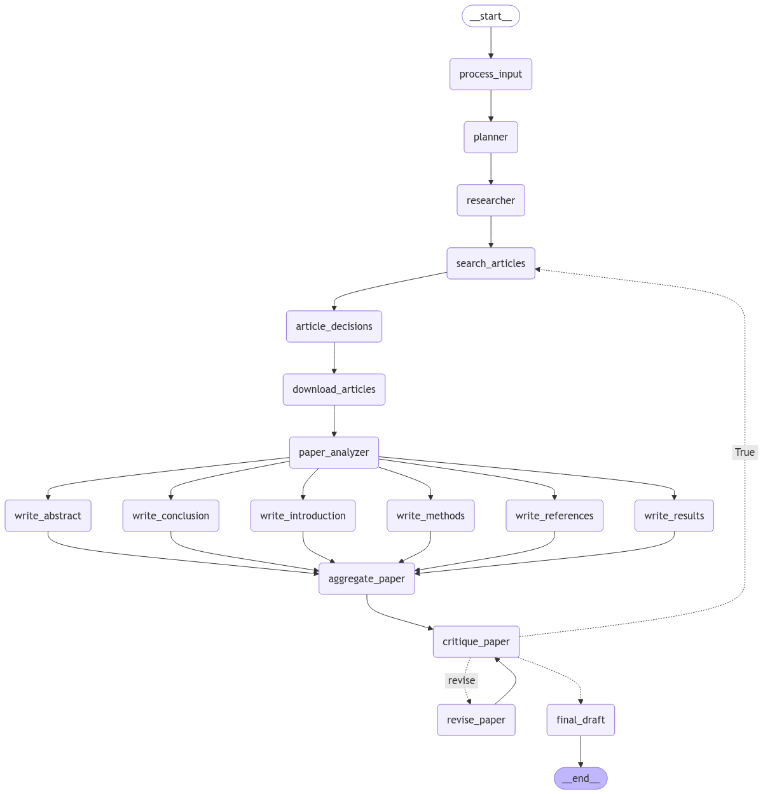

# Systematic Review of Scientific Articles

## Overview 
An advanced academic paper review system that automates the creation of systematic literature reviews. This solution uses a directed graph architecture to orchestrate a complex workflow, transforming research topics into comprehensive review papers through autonomous planning, research, analysis, and writing stages.

• Use Generative AI to compile papers from a given topic and get a systematic overview of their contents. 

• Find similarities and dissimilarities in the literature

• Be able to gain understanding information from various research domains, through meta-analysis or systematic review. 

## Getting Started

Please look at the .env.example for what is needed to run agent.py. However, you can run this code without those keys.

### Required Key
```
OPENAI_API_KEY="<YOUR_KEY>"
```

### Requirements
```
pip install -r minimal_reqs.txt
```

### Test
```
python agent.py
```

### Run on Your Own
```python
## Tool Setup
papers_tool = AcademicPaperSearchTool()

## Model Parameters
temperature=0.1
model=ChatOpenAI(model='gpt-4o-mini') # gpt-4o-mini

## Topic
topic = "diffusion models for music generation"

## Langgraph Config
thread_id = "test_thread"
checkpointer = MemorySaver()
agent_input = {"messages" : [HumanMessage(content=topic)]}
thread_config = {"configurable" : {"thread_id" : thread_id}}

## Agent Call
agent = Agent(model, [papers_tool], checkpointer=checkpointer, temperature=temperature)
result = agent.graph.invoke(agent_input, thread_config)
```

## Overview of Components



1. **Initial Stages**
- `_start_`: Beginning point of the process
- `process_input`: Initial data processing stage
- `planner`: Strategy development phase
- `researcher`: Research coordination phase

2. **Article Management**
- `search_articles`: Article search and identification
- `article_decisions`: Evaluation and selection of articles
- `download_articles`: Retrieval of selected articles
- `paper_analyzer`: In-depth analysis of papers

3. **Writing Components**
- `write_abstract`: Abstract composition
- `write_conclusion`: Conclusion development
- `write_introduction`: Introduction creation
- `write_methods`: Methodology documentation
- `write_references`: Reference compilation
- `write_results`: Results documentation

4. **Final Stages**
- `aggregate_paper`: Combining all sections
- `critique_paper`: Critical review phase
- `revise_paper`: Revision process
- `final_draft`: Final document preparation
- `_end_`: Process completion